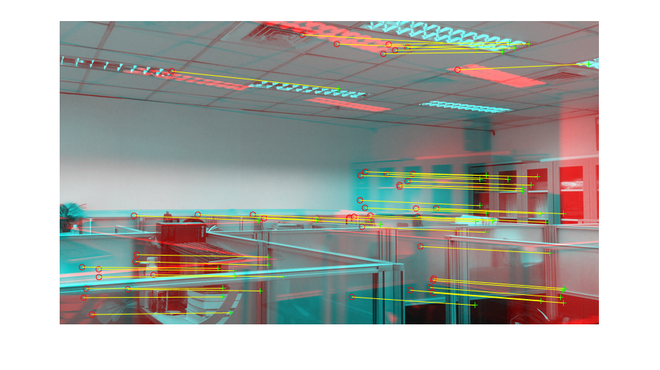
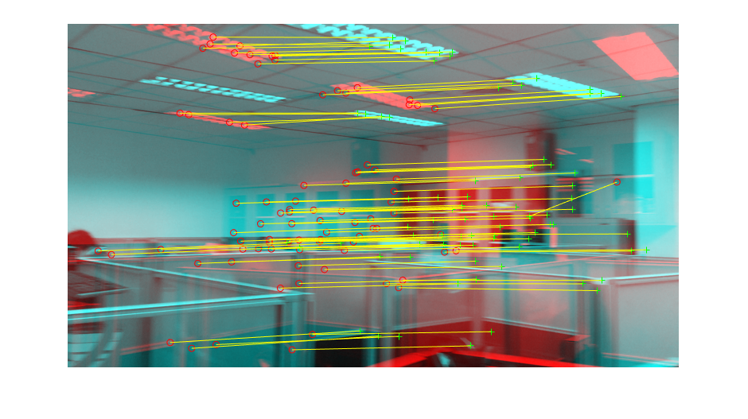
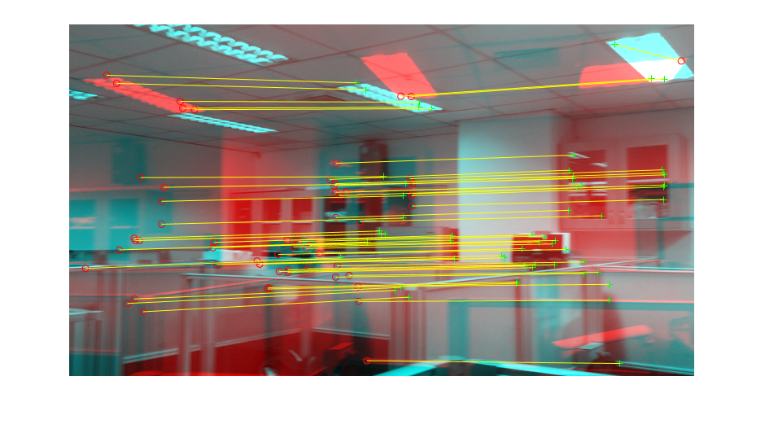
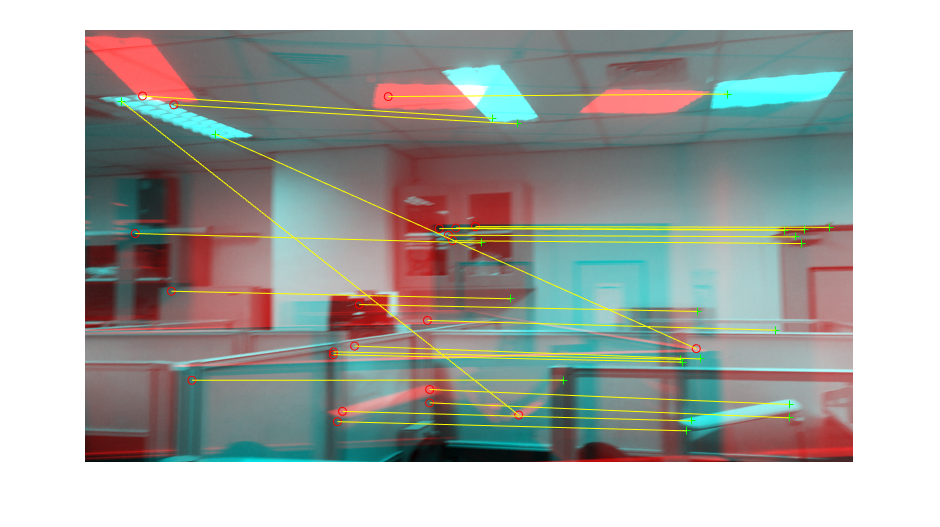
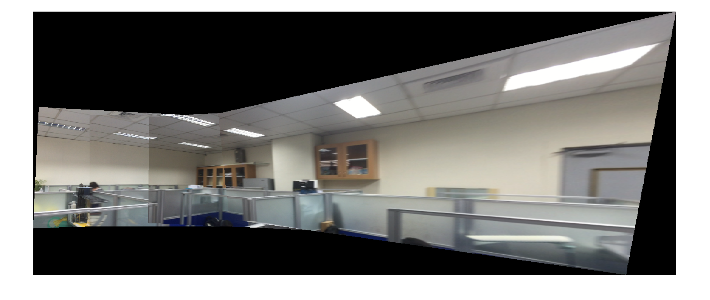
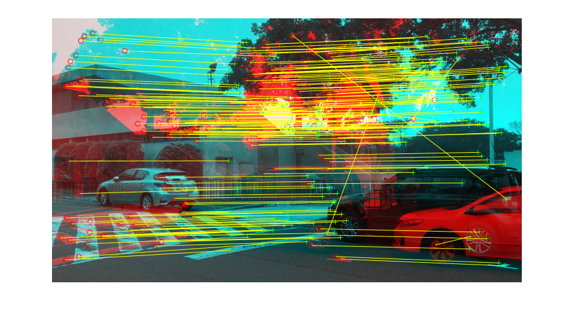
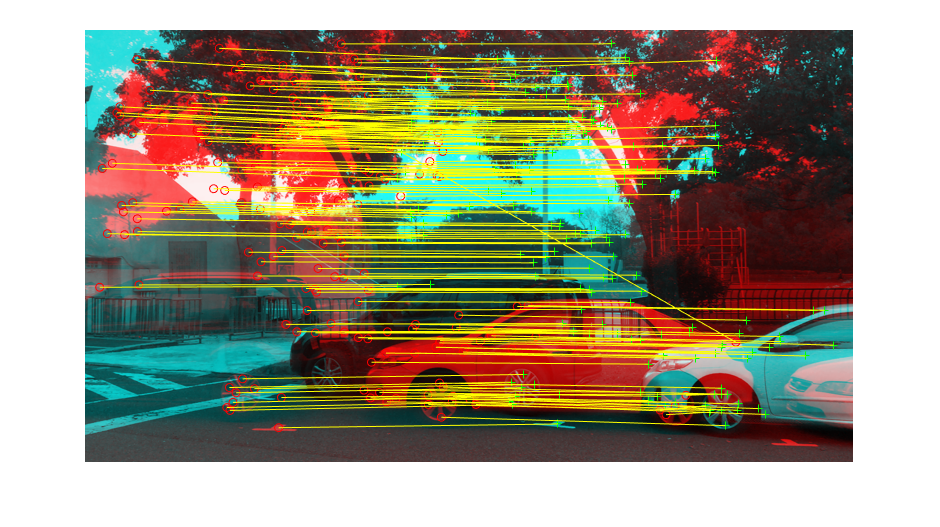
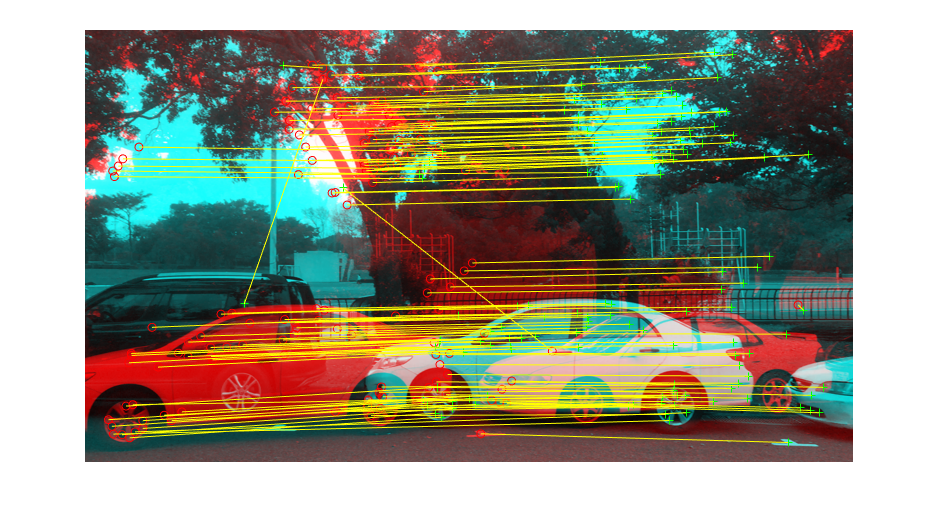
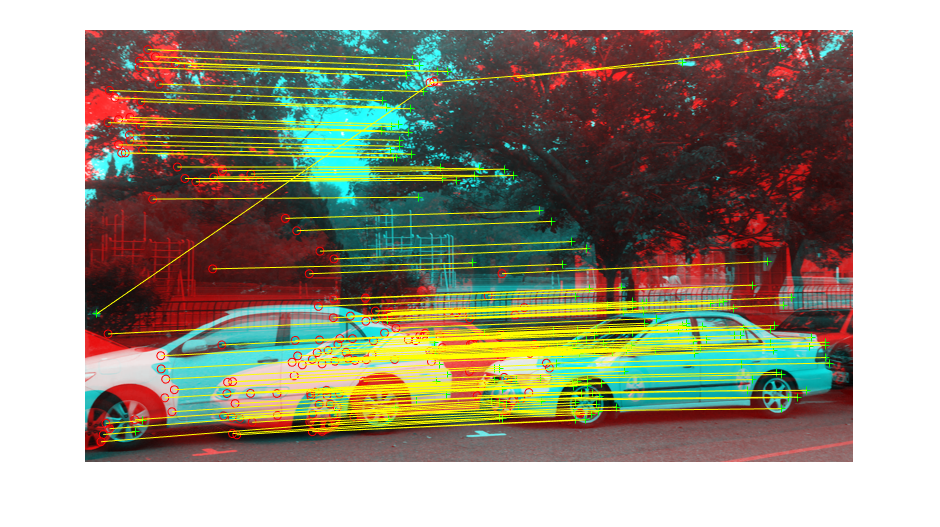
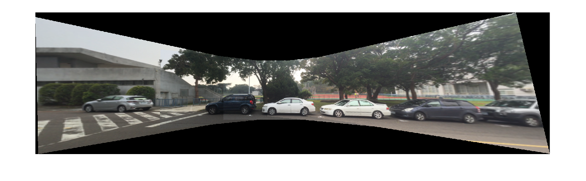

# Panoramic image stitching by projective transformation with RANSAC
Fitting **homography models** that map a set of continuous images one by one, multiple image pairs are successively registered relative to each other to form a **panorama**. 

## Training Data 
To mimic the **panorama camera** in the recent smartphone, the training data are the raw video I shot by myself. I use two set of images from the videos in experiment, one is the video of my lab, the other one is the sport ground in NCTU. 

## Feature matching
Compute interest points in each image and characterize the region around
each point using the region descriptor – **SIFT**, allowing us to greedily
associate points based on the similarity of the SIFT. However, a set of
matches aren’t 100% correct, **outliers** can severely affect the ability to
compute the transformation between the images.

## Transformation models
Here choose the most general one – **homography**. There is no closed solution to this non-linear problem, so we will optimize it by **gradient descent**. Moreover, initial parameters plays a big role in this problem, so there will be two step to implement. 
- initialization
- optimization

## RANSAC
To solve the mismatch problem mentioned above, RANSAC is a general method for fitting models to data where the data are intervened by **outliers**. It works by repeatedly fitting models by some **random subsets** of the data. Since there are **8** unknowns in the matrix that defines the homography and 2 linear constrains, the minimum of subsets is 4. Choose 4 matches randomly and compute the homography, and then count the amount of **supporters** in the whole dataset. After a fixed number of iterations of this procedure, recompute homography based on the **best agreement** with the most supporters. 

## Result

### Lab

|||
|--------------------------------------------|--------------------------------------------|
|1->2|2->3|
|||
|3->4|4->5|

||
|--------------------------------------------|
|panorama|

### Sport ground

|||
|--------------------------------------------|--------------------------------------------|
|1->2|2->3|
|||
|3->4|4->5|

||
|--------------------------------------------|
|panorama|

